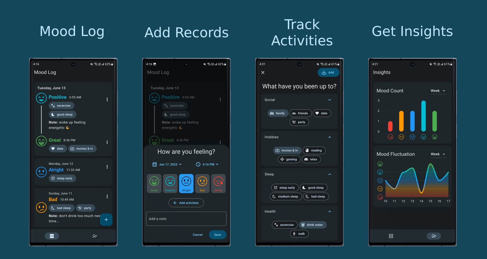
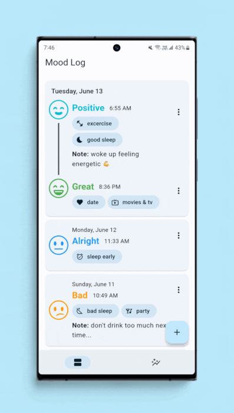

# Happio - Mood Tracker

A simple **Mood Tracker** application designed to monitor and analyze your daily mood fluctuations with a few taps.

Built with the Flutter Framework utilizing [Hive](https://github.com/hivedb/hive/tree/master/hive) for persistent storage, [Riverpod](https://riverpod.dev) for state management and [GoRouter](https://pub.dev/packages/go_router) for routing.

## Features

- Log your daily mood
- Multiple mood entries in a day
- Track activities that influence your mood
- Graph your mood for better insights
- Material You dynamic theming
## Screenshots

##### Dynamic Theming

## Roadmap

- Customizable moods and activities
- Calendar view
- Activity counter
- Streaks
- Image attachment
- Daily quotes

## Author
[José Castelo](https://github.com/jccb15)
